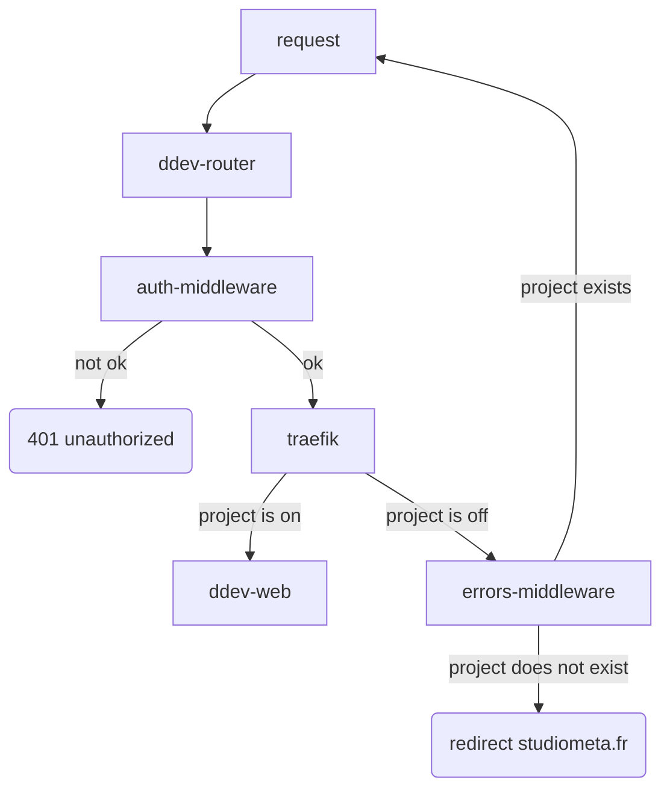
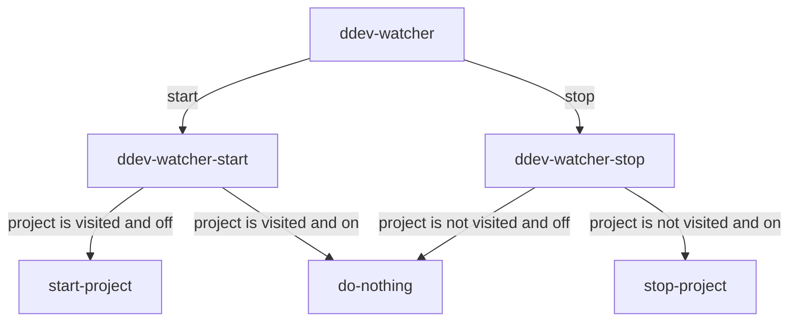

# 🚦 Trafic

A DDEV add-on to configure a server for preview environments with auth and scale to zero features.

## Installation

On a fresh installation of Ubuntu 24.x with the `ubuntu` user having sudo access: 

1. Clone the repository
2. Run the `./bin/trafic install` script

The install script will : 

- Install Docker, DDEV and required dependencies
- Create a `ddev` user with access to ddev and docker 
- Configure DDEV with a given custom project TLD 
- Add custom Traefik configurations to DDEV
- Start the Traefik middleware for auth and scale-to-zero features

## To-do

- [ ] update architecture doc
- [ ] setup unattended-upgrade

## Architecture

This project is made of the following:

- a DDEV project serving as a Traefik errors middleware
- a DDEV project serving as a Traefik forward auth middleware
- a DDEV `watcher` command to start and stop projects based on their access
- custom configurations for Traefik to enable advanced logging and add the auth middleware to the default config

The flow of a request is as follow:

Two CRON jobs with the `ddev watcher start` and `ddev watcher stop` must be configured.

