# 🚦 Trafic

[](https://www.npmjs.com/package/@studiometa/trafic-cli/)
[](https://www.npmjs.com/package/@studiometa/trafic-cli/)


**DDEV preview environments on any Linux server.**

Trafic turns a VPS into a preview server for your web projects. It handles authentication, scale-to-zero, auto-start, and deployments from CI — all powered by [DDEV](https://ddev.com) and [Traefik](https://traefik.io).

## Features

- **DDEV-native** — No custom Dockerfiles needed. Works with WordPress, Laravel, Drupal, and any DDEV-compatible project.
- **Scale-to-zero** — Idle projects are stopped automatically to save RAM. They restart on the next request.
- **Authentication** — Forward auth via Traefik with IP whitelist, tokens, basic auth, and per-hostname rules.
- **Preview environments** — Create and destroy environments from CI, like Vercel but for PHP.
- **Simple CLI** — `setup` (server), `deploy` (CI), `destroy` (cleanup).
- **TOML config** — Simple, readable configuration.
- **Zero vendor lock-in** — Runs on any Linux VPS with SSH access.

## How it works

```mermaid
flowchart TD
  request[HTTPS request] --> traefik[Traefik / DDEV router]
  traefik --> forwardAuth[forwardAuth → trafic agent]
  forwardAuth --> |200 OK| ddev-web[DDEV project]
  forwardAuth --> |401| basic-auth[Basic auth prompt]
  traefik --> |502 error| errors[errors middleware → trafic agent]
  errors --> |known project| waiting[Waiting page + auto-start]
  errors --> |unknown project| error-page[Error page]
```



## Quick start

```bash
# Setup a server (run on the server as root)
npx @studiometa/trafic-agent setup --tld=previews.example.com --email=admin@example.com

# Deploy from CI
npx @studiometa/trafic-cli deploy \
  --host=server.example.com \
  --name=my-app \
  --branch=main \
  --sync="dist/" \
  --script="composer install --no-dev"

# Your app is live at https://my-app.previews.example.com
```

## Packages

| Package | Description | npm |
| ------- | ----------- | --- |
| [`@studiometa/trafic-cli`](packages/trafic-cli/) | CLI for deploying projects from CI | [](https://www.npmjs.com/package/@studiometa/trafic-cli/) |
| [`@studiometa/trafic-agent`](packages/trafic-agent/) | Server agent (auth, scale-to-zero) | [](https://www.npmjs.com/package/@studiometa/trafic-agent/) |

## Requirements

**Server:**
- Ubuntu 24.04 LTS
- Root access (for initial setup)
- Wildcard DNS (`*.previews.example.com` → server IP)

**CI:**
- Node.js 24+
- SSH access to the server

## CI examples

<details>
<summary>GitLab CI</summary>

```yaml
deploy_preview:
  stage: deploy
  image: node:24
  before_script:
    - eval $(ssh-agent -s)
    - chmod 600 "$SSH_PRIVATE_KEY"
    - ssh-add "$SSH_PRIVATE_KEY"
  script:
    - npx @studiometa/trafic-cli deploy
        --host $SSH_HOST
        --name $CI_PROJECT_PATH_SLUG
        --preview $CI_MERGE_REQUEST_IID
        --sync "dist/"
        --script "composer install --no-dev"
  rules:
    - if: $CI_MERGE_REQUEST_ID

destroy_preview:
  stage: deploy
  image: node:24
  when: manual
  before_script:
    - eval $(ssh-agent -s)
    - chmod 600 "$SSH_PRIVATE_KEY"
    - ssh-add "$SSH_PRIVATE_KEY"
  script:
    - npx @studiometa/trafic-cli destroy
        --host $SSH_HOST
        --name $CI_PROJECT_PATH_SLUG
        --preview $CI_MERGE_REQUEST_IID
  rules:
    - if: $CI_MERGE_REQUEST_ID
```

</details>

<details>
<summary>GitHub Actions</summary>

```yaml
deploy_preview:
  runs-on: ubuntu-latest
  if: github.event_name == 'pull_request'
  steps:
    - uses: actions/checkout@v4
    - uses: webfactory/ssh-agent@v0.9.0
      with:
        ssh-private-key: ${{ secrets.SSH_PRIVATE_KEY }}
    - run: npx @studiometa/trafic-cli deploy
        --host ${{ vars.SSH_HOST }}
        --name ${{ github.event.repository.name }}
        --preview ${{ github.event.pull_request.number }}
        --sync "dist/"
        --script "composer install --no-dev"

destroy_preview:
  runs-on: ubuntu-latest
  if: github.event_name == 'pull_request' && github.event.action == 'closed'
  steps:
    - uses: webfactory/ssh-agent@v0.9.0
      with:
        ssh-private-key: ${{ secrets.SSH_PRIVATE_KEY }}
    - run: npx @studiometa/trafic-cli destroy
        --host ${{ vars.SSH_HOST }}
        --name ${{ github.event.repository.name }}
        --preview ${{ github.event.pull_request.number }}
```

</details>

## Documentation

- [CLI README](packages/trafic-cli/README.md) — Deploy and destroy commands
- [Agent README](packages/trafic-agent/README.md) — Server setup and configuration
- [Example config](examples/config.toml) — Full configuration reference

## Contributing

See [CONTRIBUTING.md](CONTRIBUTING.md) for development setup and guidelines.

## Security

See [SECURITY.md](SECURITY.md) for reporting vulnerabilities.

## License

[MIT](LICENSE) © [Studio Meta](https://www.studiometa.fr/)
